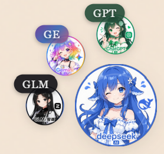
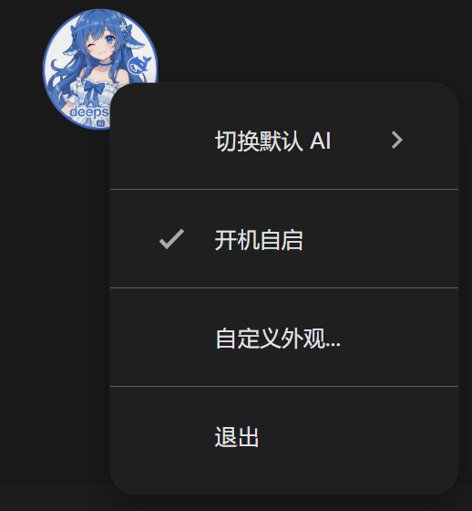
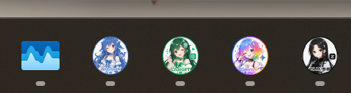

<div align="center">

  

  <h1>DeepSeek Desktop</h1>

  <p><strong>告别 API 费用，一个悬浮球直达多个 AI！</strong></p>

  <p>
    <a href="https://github.com/ChaoPhone/DeepSeek-Desktop/releases">⬇️ 下载</a> •
    <a href="#功能">功能</a> •
    <a href="#开发">开发</a>
  </p>

</div>

---

## 为什么做这个？

API 费用太贵？想同时用多个 AI？

这个悬浮球直接打开 AI 网页版，**免费、无限制、不用 API**。悬停展开副球，一键切换 DeepSeek、ChatGPT、Gemini、智谱 GLM。

---

## 功能

- **多 AI 支持** - DeepSeek、ChatGPT、Gemini、智谱 GLM，悬停展开副球选择
- **悬浮球** - 想放哪里放哪里，拖拽就行
- **一键打开** - 点击直接进入 AI Chat
- **自定义外观** - 颜色、大小、透明度随你调
- **开机自启** - 开机就等着你用
- **多窗口** - 想开几个对话都行
- **任务栏区分** - 不同 AI 显示不同图标

---

## 截图

| 悬浮球展开 | 右键菜单 |
|:---:|:---:|
|  |  |

| 任务栏区分 |
|:---:|
|  |

---

## 下载

[安装版](https://github.com/ChaoPhone/DeepSeek-Desktop/releases) - 传统安装，有卸载程序

---

## 开发

```bash
git clone https://github.com/ChaoPhone/DeepSeek-Desktop.git
cd DeepSeek-Desktop
npm install
npm start        # 开发运行
npm run build    # 打包 exe
```

---

## 更新日志

### v1.2.7
- **主球大小范围调整** - 默认40px，范围20-80px
- **副球间距动态调整** - 根据主球大小自动计算间距
- **拖动优化** - 改用绝对位置计算，更跟手

### v1.2.6
- **刷新按钮** - 聊天窗口左上角新增刷新按钮，SVG 旋转动画

### v1.2.5
- **多屏适配** - 聊天窗口在悬浮球所在显示器创建
- **主球置顶** - 右键菜单可切换，始终保持在最前
- **副球智能展开** - 根据位置自动调整展开方向
- **品牌色标签** - 副球标签使用对应 AI 品牌色
- **白条问题修复** - 彻底解决窗口白条闪烁
- **设置窗口优化** - 在悬浮球旁边显示，不遮挡

---

<div align="center">

喜欢就点个 ⭐ Star 吧！

Made with ❤️ by [ChaoPhone](https://github.com/ChaoPhone)

</div>